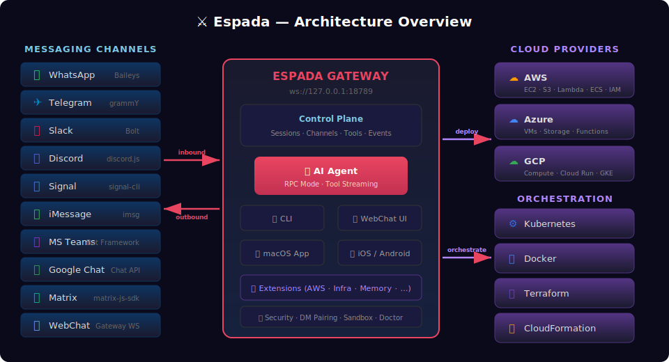
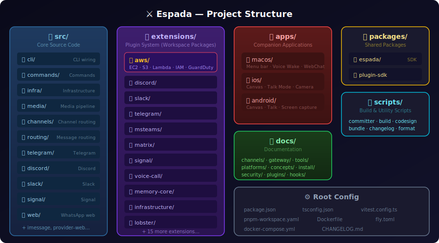
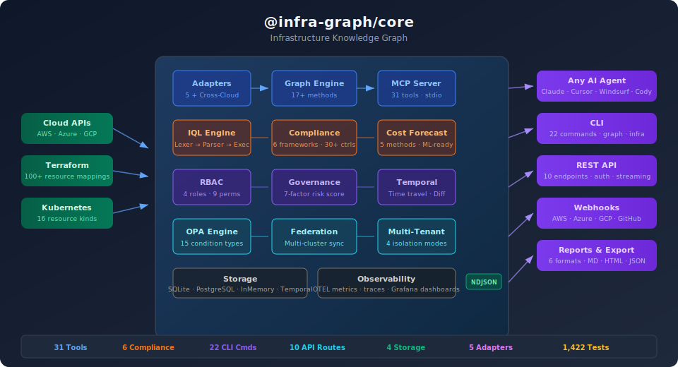

# Espada — Software Infrastructure Automation Platform

**Espada** is a self-hosted, local-first software infrastructure automation platform powered by conversational AI. It manages cloud infrastructure, containers, deployments, compliance, and operations through natural language commands sent via 16+ messaging channels — or through its built-in web dashboard, CLI, REST API, and companion apps.

> Automate your infrastructure through conversation — deploy to AWS, Azure, GCP, orchestrate Kubernetes and Terraform, enforce compliance, make phone calls, run deterministic workflows, and manage multi-agent teams, all from your favorite messaging app.

---

## What is Espada?

Espada is a **single always-on Gateway process** that connects to your messaging channels and lets you manage infrastructure through natural language. The Gateway is the control plane — a multiplexed WebSocket + HTTP server (default `127.0.0.1:18789`) that handles sessions, channels, tools, routing, and events, while one or more AI agents process your requests and execute operations.

The Gateway exposes:
- **WebSocket control plane** — Typed JSON protocol for clients, nodes, and automations
- **OpenAI-compatible HTTP API** — `/v1/chat/completions` and `/v1/responses` endpoints
- **Tool invocation API** — `/tools/invoke` for programmatic tool calls
- **Canvas host** — Agent-editable HTML and A2UI surfaces (default port `18793`)
- **Hot config reload** — Safe changes applied live; critical changes via in-process restart (`SIGUSR1`)

<p align="center">
  
</p>

---

## Supported Messaging Channels

| Channel | Type | Library/Protocol |
|---------|------|-----------------|
| WhatsApp | Core | Baileys |
| Telegram | Core | grammY |
| Slack | Core | Bolt |
| Discord | Core | discord.js |
| Google Chat | Core | Chat API |
| Signal | Core | signal-cli |
| iMessage | Core | imsg (macOS only) |
| WebChat | Core | Gateway WebSocket |
| Microsoft Teams | Extension | Bot Framework |
| Matrix | Extension | matrix-js-sdk |
| BlueBubbles | Extension | BlueBubbles API |
| Zalo | Extension | Zalo OA API |
| LINE | Extension | LINE Messaging API |
| Mattermost | Extension | Mattermost API |
| Nostr | Extension | Nostr Protocol |
| Twitch | Extension | Twitch IRC |

---

## Supported LLM Providers

Espada supports **14+ LLM providers** with automatic failover, auth profile rotation, and session-pinned credentials:

| Provider | Environment Variable | Default Model |
|----------|---------------------|---------------|
| Anthropic | `ANTHROPIC_API_KEY` | `claude-sonnet-4-20250514` |
| OpenAI | `OPENAI_API_KEY` | `gpt-4.1` |
| Google Gemini | `GEMINI_API_KEY` | `gemini-2.5-flash-preview-04-17` |
| OpenRouter | `OPENROUTER_API_KEY` | `claude-sonnet-4-20250514` |
| Groq | `GROQ_API_KEY` | `llama-3.3-70b-versatile` |
| xAI | `XAI_API_KEY` | `grok-3-mini` |
| Mistral | `MISTRAL_API_KEY` | `mistral-large-latest` |
| DeepSeek | `DEEPSEEK_API_KEY` | `deepseek-chat` |
| Cerebras | `CEREBRAS_API_KEY` | `llama-3.3-70b` |
| Venice AI | `VENICE_API_KEY` | `llama-3.3-70b` |
| MiniMax | `MINIMAX_API_KEY` | `MiniMax-M1` |
| Moonshot AI | `MOONSHOT_API_KEY` | `kimi-k2-0905-preview` |
| GitHub Copilot | `GH_TOKEN` / `GITHUB_TOKEN` | `claude-sonnet-4` |
| Ollama (local) | *(none — auto-detected)* | `llama3.2` |

Model failover uses two stages: **auth profile rotation** within a provider (exponential backoff cooldowns, round-robin with OAuth-before-API-key priority), then **model fallback** to the next entry in `agents.defaults.model.fallbacks`. Profiles are pinned per session for cache efficiency.

---

## What Can It Do?

### Cloud Infrastructure Management

- **AWS** — EC2, S3, Lambda, IAM, VPC, CodePipeline, CodeBuild, Organizations, GuardDuty, Backup, Cost Explorer, and pre-built architecture templates
- **Azure** — Web Apps, Traffic Manager, deployment strategies (blue-green, canary, rolling, A/B), and full resource management
- **GCP** — Resource management via the GCP extension
- **Container Orchestration** — Deploy and manage Docker containers and Kubernetes clusters
- **Infrastructure as Code** — Execute Terraform plans, Pulumi stacks, and CloudFormation templates

### Infrastructure Knowledge Graph

Unified multi-cloud graph with a custom query language, compliance scanning, blast radius analysis, and 31 AI agent tools. See [Infrastructure Knowledge Graph](#infrastructure-knowledge-graph-infra-graphcore) below.

### Policy Engine & Compliance

- **6 Compliance Frameworks** — SOC 2, HIPAA, PCI-DSS, ISO 27001/GDPR, NIST 800-53, CIS Benchmarks with 30+ concrete controls and auto-remediation
- **OPA-Style Policy Engine** — 7 policy types, 18 condition types, 4 action levels (deny, warn, require_approval, notify)
- **Audit Trail** — Full event logging with compliance reporting and waiver management

### Multi-Agent Orchestration

- **Isolated Agents** — Each with its own workspace, persona (`SOUL.md`), memory, auth profiles, and skills
- **Deterministic Routing** — Bind channels, accounts, groups, or individual peers to specific agents via bindings
- **Broadcast Groups** — Multiple agents respond to the same message in parallel or sequentially
- **Sub-Agents** — Spawn background workers that run isolated tasks and announce results back, with configurable models and auto-archive

### Workflow Pipelines (Lobster)

- **Deterministic Pipelines** — Multi-step tool sequences executed without the LLM (saves tokens, improves reliability)
- **Approval Gates** — Side-effect steps pause for human sign-off and return a durable resume token
- **Resumable State** — Pick up exactly where you stopped without re-running earlier steps
- **Optional LLM Steps** — Structured AI classification within otherwise deterministic flows

### Voice Calls (Real Telephony)

- **Outbound/Inbound Calls** — Via Telnyx, Twilio, and Plivo
- **Full Call Lifecycle** — State machine with voicemail detection, real-time TTS, media streaming, transcription
- **Provider Agnostic** — Normalized cross-provider abstraction with webhook security and call persistence

### Memory System

- **Plain Markdown** — Daily logs (`memory/YYYY-MM-DD.md`) + curated long-term memory (`MEMORY.md`)
- **Pre-Compaction Flush** — Silent agentic turn writes durable notes before context is compacted
- **Vector Search** — Semantic search over memory files via the memory plugin (core or LanceDB)
- **Per-Agent Isolation** — Each agent has its own memory in its own workspace

### Browser Automation

- **Isolated Profiles** — Separate Chrome/Brave/Edge instances under agent control (`espada`, `work`, `remote`)
- **Full Interaction** — Open tabs, click, type, drag, screenshot, snapshot, PDF generation
- **Chrome Extension Relay** — Bridge to the user's system browser via CDP

### Text-to-Speech

- **3 Providers** — ElevenLabs, OpenAI, Edge TTS (free, no API key required)
- **Auto-TTS Mode** — Convert all replies to audio; Telegram gets native voice-note bubbles
- **Summary Mode** — Optional LLM summarization before TTS for long replies

### Automation

- **Cron Scheduler** — Persistent jobs with one-shot (`at`), interval (`every`), or cron-expression schedules; main-session or isolated execution
- **Webhooks** — HTTP endpoints that trigger agent runs from external systems (CI/CD, monitoring, etc.)
- **Gmail Pub/Sub** — Real-time email triggers via Google Pub/Sub push → Espada webhook → agent run
- **Hooks** — Event-driven scripts for `/new`, `/reset`, gateway boot, and session lifecycle; discoverable and installable like npm packages

### Session Management

- **Context Compaction** — Auto-summarizes older conversation near context limits with pre-flush memory writes
- **Session Pruning** — Trims old tool results in-memory without rewriting JSONL history
- **Block Streaming** — Progressive message delivery with code-fence-aware chunking, paragraph boundaries, and human-like pacing delays
- **Telegram Draft Streaming** — Real-time token-level updates in a draft bubble
- **Thinking Levels** — `off | minimal | low | medium | high | xhigh` controlling LLM reasoning depth per-message or per-session
- **Session Scoping** — `main` (all DMs converge), `per-peer`, or `per-channel-peer` with cross-channel identity linking

### Skills & EspadaHub

- **AgentSkills-Compatible** — Skill folders with `SKILL.md` frontmatter teach the agent how to use tools
- **Three Load Locations** — Bundled, managed (`~/.espada/skills`), workspace (`<workspace>/skills`)
- **EspadaHub** — Public skills registry at [espadahub.com](https://espadahub.com) for discovery, install, update, and sync
- **Plugin Skills** — Plugins can ship their own skills via the plugin manifest

### Security

- **DM Pairing** — Unknown senders receive a pairing code; approve via `espada pairing approve`
- **Exec Approvals** — Allowlist/deny per command with approval prompts (`security: allowlist | deny | full`)
- **Sandboxing** — Docker-based isolation with per-agent scope and workspace access controls (`rw`/`ro`/`none`)
- **Tool Policy** — Global and per-agent allow/deny lists for every tool
- **Formal Verification** — TLA+/TLC machine-checked security models covering gateway exposure, node execution, pairing, ingress gating, and routing isolation
- **OAuth** — PKCE token exchange, multi-account profiles, per-session overrides, automatic refresh under file locks

---

## Project Structure

<p align="center">
  
</p>

---

## Extensions & Plugin System

Espada uses a plugin architecture. Extensions live under `extensions/` as workspace packages. Each extension can register:

- **Agent Tools** — New capabilities the AI agent can use
- **Gateway RPC Methods** — Custom WebSocket endpoints
- **Gateway HTTP Handlers** — Custom REST endpoints
- **Channel Handlers** — New messaging channel integrations
- **CLI Commands** — Additional CLI subcommands
- **Background Services** — Long-running processes within the Gateway
- **Skills** — Skill directories in the plugin manifest
- **Auto-Reply Commands** — Execute without invoking the AI agent

Plugins run **in-process** with the Gateway. They are TypeScript modules loaded at runtime via jiti.

### AWS Extension

The AWS extension (`extensions/aws/`) provides comprehensive AWS infrastructure management:

- **EC2 Management** — Start, stop, terminate instances; manage security groups and auto-scaling
- **S3 Operations** — Bucket management, object operations, lifecycle policies
- **Lambda** — Function deployment, invocation, and management
- **IAM & Security** — Policy management, GuardDuty integration, compliance scanning
- **Networking** — VPC, subnets, route tables, load balancers
- **CI/CD** — CodePipeline, CodeBuild, deployment automation
- **Organizations** — Multi-account management and governance
- **Backup** — Automated backup plans and recovery operations
- **Cost Management** — Spending analysis and optimization
- **Infrastructure Catalog** — Pre-built architecture templates

### Azure Extension

The Azure extension (`extensions/azure/`) provides Azure infrastructure management:

- **Web Apps** — App Service deployment and management
- **Traffic Manager** — DNS-based traffic routing across regions
- **Deployment Strategies** — Blue-green, canary, rolling, and A/B deployments with automated rollback
- **Resource Management** — Full Azure resource lifecycle

### Additional Extensions

| Extension | Description |
|-----------|-------------|
| `gcp` | Google Cloud Platform resource management |
| `kubernetes` | Cluster orchestration and management |
| `terraform` | Terraform plan/apply/state operations |
| `pulumi` | Pulumi stack management |
| `knowledge-graph` | Infrastructure Knowledge Graph (see below) |
| `policy-engine` | OPA-style governance with 18 condition types |
| `compliance` | 6 compliance frameworks with auto-remediation |
| `cost-governance` | Budget tracking, spending analysis, optimization |
| `incident-lifecycle` | Incident management and alerting |
| `alerting-integration` | Alert routing and notification |
| `dr-analysis` | Disaster recovery planning and validation |
| `audit-trail` | Event logging and compliance reporting |
| `enterprise-auth` | Enterprise authentication (SSO, SAML) |
| `diagnostics-otel` | OpenTelemetry metrics, traces, and Grafana dashboards |
| `hybrid-cloud` | Hybrid cloud management |
| `infrastructure` | Infrastructure provisioning |
| `blueprints` | Pre-built architecture templates |
| `voice-call` | Real telephony via Telnyx/Twilio/Plivo |
| `memory-core` | Markdown-based memory search (default) |
| `memory-lancedb` | LanceDB-backed long-term vector memory |
| `lobster` | Deterministic workflow pipelines with approval gates |
| `llm-task` | Structured LLM classification tasks |
| `vcs` | Version control integration |
| `copilot-proxy` | VS Code Copilot Proxy bridge |
| `open-prose` | Prose/writing assistance |

### Infrastructure Knowledge Graph (`@infra-graph/core`)

The knowledge graph extension (`extensions/knowledge-graph/`) builds a unified graph of your entire cloud infrastructure — scanning, querying, and analyzing resources across AWS, Azure, GCP, and Kubernetes.

<p align="center">
  
</p>

**Key capabilities:**

- **Multi-Cloud Discovery** — 5 adapters (AWS with 21 sub-modules, Azure with 23, GCP, Kubernetes, Terraform) plus cross-cloud relationship detection
- **IQL Query Language** — Purpose-built infrastructure query language with full lexer/parser/executor: `FIND compute WHERE status = "running" AND tags.env = "prod"`
- **31 AI Agent Tools** — Blast radius, SPOF detection, drift, cost attribution, compliance, remediation, supply chain security, anomaly detection, and more
- **6 Compliance Frameworks** — SOC 2, HIPAA, PCI-DSS, ISO 27001, NIST 800-53, CIS Benchmarks with 30+ concrete controls and auto-generated remediation patches
- **MCP Server** — Expose all 31 tools to Claude Desktop, Cursor, Windsurf, or any MCP-compatible AI client
- **REST API** — 10 endpoints with Bearer auth, rate limiting, CORS, and NDJSON streaming for large topologies
- **22 CLI Commands** — `espada graph` (13 commands) and `espada infra` (9 commands) for scanning, querying, compliance, and reporting
- **Enterprise Features** — RBAC (4 roles, 9 permissions), multi-tenancy (4 isolation modes), OPA policy engine (15 condition types), governance with 7-factor risk scoring, federation
- **Temporal & Time Travel** — Point-in-time snapshots, graph diffing, evolution tracking, temporal IQL queries (`FIND * AT "2024-01-15"`)
- **4 Storage Backends** — InMemory, SQLite (WAL, 18 indexes), PostgreSQL (JSONB, GIN, materialized views), SQLite-Temporal
- **Observability** — OTEL metrics and traces (push/pull), 3 Grafana dashboards, continuous monitoring with CloudTrail/Azure/GCP event sources
- **GitHub Action** — CI/CD compliance scanning with PR comments, threshold enforcement, and OTEL export

```bash
# Scan from Terraform state
espada infra scan --terraform ./terraform.tfstate

# Live multi-cloud scan
espada infra cloud-scan --aws --azure --gcp --db ./infra.db

# Query with IQL
espada infra query --db ./infra.db "FIND database WHERE tags.env = 'prod'"

# Run compliance
espada infra compliance --db ./infra.db --framework hipaa

# Start MCP server for AI assistants
infra-graph mcp --db ./infra.db
```

> See [`extensions/knowledge-graph/README.md`](extensions/knowledge-graph/README.md) for full documentation.

---

## Multi-Agent System

Espada can run **multiple isolated agents** in a single Gateway process. Each agent has its own workspace, persona, memory, session store, auth profiles, and skills.

```bash
# Add a new agent
espada agents add work

# List agents and bindings
espada agents list --bindings
```

**Routing** is deterministic and most-specific-wins: bind by exact peer, guild/team, account, or channel. Unmatched messages go to the default agent.

**Broadcast groups** let multiple agents respond to the same message simultaneously:

```json5
{
  broadcast: {
    strategy: "parallel",
    "120363403215116621@g.us": ["code-reviewer", "security-auditor", "docs-bot"]
  }
}
```

**Sub-agents** spawn background worker runs from a running agent:
- Separate session, context, and token budget
- Configurable model (use a cheaper model for background work)
- Announce results back to the requester's chat channel
- Auto-archive after configurable timeout
- Controllable via `/subagents list|stop|log|send|info`

**Per-agent sandboxing** lets you run different agents with different security profiles (full access, read-only, Docker-isolated) and separate tool allow/deny policies.

---

## Quick Start

If you already have an API key in your environment (`ANTHROPIC_API_KEY`, `OPENAI_API_KEY`, `GEMINI_API_KEY`), or Ollama running locally:

```bash
espada quickstart
```

This will auto-detect your LLM credentials, generate a gateway token, and open a browser dashboard at `http://127.0.0.1:18789/` — **chatting in under 30 seconds**, no channel setup needed.

When you're ready to extend:

```bash
# Connect messaging channels (WhatsApp, Telegram, Discord, etc.)
espada configure --section channels

# Connect cloud providers (AWS, Azure, GCP)
espada configure --section cloud

# Full configuration wizard
espada onboard
```

### Verify

```bash
espada status          # Gateway + channel overview
espada health          # Health snapshot from the running gateway
espada doctor          # Check for misconfigurations
```

### Connect a chat channel

```bash
# WhatsApp (QR code login)
espada channels login

# Send a test message
espada message send --to +1234567890 --message "Hello from Espada"

# Talk to the agent from the CLI
espada agent --message "List my EC2 instances in us-east-1" --thinking high
```

---

## Development

```bash
git clone https://github.com/saifaldin14/Espada-Auto.git
cd Espada-Auto

pnpm install
pnpm ui:build          # auto-installs UI deps on first run
pnpm build

# Dev loop (auto-reload)
pnpm gateway:watch

# Run tests
pnpm test

# Lint + format
pnpm lint && pnpm format
```

Run CLI commands from the repo without a global install: `pnpm espada ...`

Open the dashboard: `espada dashboard` (or browse `http://127.0.0.1:18789/`).

---

## Chat Commands

Send these in any connected messaging channel:

| Command | Description |
|---------|-------------|
| `/status` | Session status (model, tokens, compactions) |
| `/new` or `/reset` | Reset the session (optionally set a new model: `/new claude-sonnet-4`) |
| `/compact` | Compact session context (optionally with focus instructions) |
| `/think <level>` | Set thinking level (`off\|minimal\|low\|medium\|high\|xhigh`) |
| `/reasoning on\|off\|stream` | Show/hide model reasoning blocks |
| `/verbose on\|full\|off` | Toggle verbose tool logging |
| `/model` | List or switch models |
| `/tts on\|off\|always\|once` | Control text-to-speech |
| `/usage off\|tokens\|full` | Usage footer setting |
| `/exec host=... security=...` | Per-session exec defaults (host, security, approval, node) |
| `/send on\|off\|inherit` | Control message delivery for this session |
| `/subagents list\|stop\|log\|info\|send` | Manage sub-agent runs |
| `/restart` | Restart the gateway |

---

## Companion Apps

| App | Platform | Features |
|-----|----------|----------|
| Espada.app | macOS | Menu bar gateway control, Voice Wake, WebChat |
| iOS Node | iOS | Canvas, Voice Wake, Talk Mode, camera |
| Android Node | Android | Canvas, Talk Mode, camera, screen recording |

Nodes connect to the Gateway over WebSocket with `role: node` and expose device commands (`canvas.*`, `camera.*`, `screen.record`, `location.get`).

---

## Agent Workspace

The agent uses a workspace directory (`~/espada` by default) as its working directory. Bootstrap files are injected into the agent context at session start:

| File | Purpose |
|------|---------|
| `AGENTS.md` | Operating instructions and memory |
| `SOUL.md` | Persona, boundaries, tone |
| `TOOLS.md` | User-maintained tool usage notes |
| `IDENTITY.md` | Agent name, vibe, emoji |
| `USER.md` | User profile and preferred address |
| `BOOTSTRAP.md` | One-time first-run ritual (auto-deleted) |

Memory is stored as plain Markdown:
- `memory/YYYY-MM-DD.md` — Daily logs (append-only)
- `MEMORY.md` — Curated long-term memory

Skills live under `<workspace>/skills/` (per-agent), `~/.espada/skills/` (shared), or bundled with the install.

---

## Configuration

Config lives at `~/.espada/espada.json`. The workspace (skills, prompts, memories) lives at `~/espada`.

Minimal config:

```json5
{
  agent: {
    model: "anthropic/claude-opus-4-5"
  }
}
```

Interactive configuration:

```bash
espada configure                  # Full interactive config
espada configure --section cloud  # Cloud providers only
espada configure --section channels  # Messaging channels only
espada configure --section web    # Web search (Brave API key)
```

---

## Security

- **DM Pairing** — Enabled by default; unknown senders receive a pairing code
- **Exec Approvals** — Allowlist/deny per command with approval prompts
- **Sandboxing** — Docker-based isolation per agent with tool allow/deny policies
- **Tool Policy** — Global and per-agent allow/deny lists
- **Formal Verification** — TLA+/TLC machine-checked security models for authorization, session isolation, tool gating, pairing, and routing ([models repo](https://github.com/vignesh07/espada-formal-models))
- **OAuth** — PKCE token exchange, multi-account profiles, automatic refresh under file locks

```bash
espada pairing approve <channel> <code>    # Approve a sender
espada security audit --deep               # Full security audit
espada doctor                              # Check for misconfigurations
espada sandbox explain                     # Debug sandbox/tool policy
```

---

## Interaction Surfaces

| Surface | Description |
|---------|-------------|
| **CLI** (`espada`) | Full CLI with agent, graph, infra, config, plugins, hooks, and diagnostic commands |
| **Web Dashboard** | Browser UI at `127.0.0.1:18789` with WebChat, sessions, nodes, and configuration |
| **Messaging Apps** | All 16+ channels as equal-class interaction surfaces |
| **macOS / iOS / Android** | Native companion apps with Voice Wake, Talk Mode, Canvas, camera |
| **MCP Server** | Expose 31 knowledge graph tools to Claude Desktop, Cursor, Windsurf, or any MCP client |
| **REST API** | 10 knowledge graph endpoints with Bearer auth, rate limiting, and NDJSON streaming |
| **OpenAI-Compatible API** | `/v1/chat/completions` and `/v1/responses` for programmatic access |

---

## License

Espada is a new product built by Saif Al-Din Ali. It incorporates foundational components from OpenClaw (MIT License, by Peter Steinberger). Espada itself — including all architecture, integrations, and original work — is **Proprietary — All Rights Reserved**. See [LICENSE](LICENSE) for full details.
