# AWS Test Environment Setup — Command Log

## Prerequisites

- **Node.js 22+** via nvm
- **pnpm** package manager
- **AWS CLI v2** installed (`brew install awscli`)
- **VS Code** with `suhaibbinyounis.github-copilot-api-vscode` extension (Copilot LM API proxy)

---

## Step 1: Switch to Node 22

```bash
nvm use 22
# Output: Now using node v22.22.1 (npm v10.9.4)
```

## Step 2: Install Dependencies

```bash
cd /Users/saifal-dinali/Downloads/espada
pnpm install

cd extensions/aws
pnpm install
```

## Step 7: Activate VS Code Copilot LM API Proxy

The Espada agent needs an LLM. The `suhaibbinyounis.github-copilot-api-vscode` extension serves GitHub Copilot models on `localhost:3030`.

```bash
# Activated via VS Code command palette:
#   github-copilot-api-vscode.showServerControls

# Verified:
curl -s http://127.0.0.1:3030/v1/models
# Returns 25 models (claude-opus-4.6, gpt-5.2, gemini-3-pro, etc.)

curl -s http://127.0.0.1:3030/v1/chat/completions \
  -H "Content-Type: application/json" \
  -d '{"model":"gpt-5.2","messages":[{"role":"user","content":"Say hello"}],"max_tokens":20}'
# Returns: {"choices":[{"message":{"content":"Hello."}}]}
```

**Added to `.env`:**
```env
COPILOT_PROXY_BASE_URL=http://127.0.0.1:3030/v1
COPILOT_PROXY_API_KEY=n/a
```

## Step 8: Enable AWS Plugin & Configure Region

```bash
pnpm espada plugins enable aws
pnpm espada config set plugins.entries.aws.config.defaultRegion us-east-1
```

Verified:
```bash
pnpm espada plugins list 2>&1 | grep -i aws
# [plugins] Registering AWS extension
# [plugins] [AWS] AWS extension registered successfully
# AWS Core Services | aws | loaded
```

## Step 9: Start Gateway

```bash
pnpm espada gateway start
# Output: Restarted LaunchAgent: gui/501/bot.molt.gateway
```

## Step 10: Run Espada Agent — AWS Test Environment Setup

Single prompt that triggers Espada's prompt analysis to call multiple AWS tools automatically:

```bash
source .env && pnpm espada agent --agent main --local --json --timeout 300 \
  --message "Set up a test AWS environment in us-east-1. Please: \
    1) Verify my AWS identity using aws_authenticate, \
    2) Discover existing AWS services using aws_discover, \
    3) List existing EC2 instances using aws_ec2, \
    4) List existing S3 buckets using aws_s3, \
    5) Create a test security group named espada-test-sg allowing SSH (port 22) and HTTP (port 80) using aws_security_group, \
    6) Provide a full summary of my AWS environment."
```

### Agent Results

**Identity:**
- Account: `187093629249`
- Principal: `arn:aws:iam::187093629249:root`
- Region: `us-east-1`

**Existing Resources Found:**
- VPC: `vpc-0f657f2a72e2de84b` (default, `172.31.0.0/16`)
- EC2 Instances: 0
- S3 Buckets: 4
  - `amplify-nutrino-staging-161730-deployment`
  - `amplify-twitter-dev-183547-deployment`
  - `espada-agent-demo-1770048656`
  - `twitter-storage183547-dev`

**Created:**
- Security Group: `espada-test-sg` (`sg-0a69d1966c7ed6ee1`)
  - TCP 22 (SSH) from `0.0.0.0/0`
  - TCP 80 (HTTP) from `0.0.0.0/0`
  - Attached to default VPC

---

## Espada Config Reference

**`~/.espada/espada.json`** (relevant sections):
```json
{
  "gateway": { "mode": "local" },
  "plugins": {
    "entries": {
      "aws": { "enabled": true, "config": { "defaultRegion": "us-east-1" } },
      "copilot-proxy": { "enabled": true },
      "knowledge-graph": { "enabled": true }
    }
  },
  "models": {
    "providers": {
      "copilot-proxy": {
        "baseUrl": "http://127.0.0.1:3030/v1",
        "apiKey": "n/a",
        "api": "openai-completions"
      }
    }
  }
}
```

**`.env`:**
```env
AWS_ACCOUNT_ID=548846591491
AWS_ACCOUNT_NAME=saifaldin14
COPILOT_PROXY_BASE_URL=http://127.0.0.1:3030/v1
COPILOT_PROXY_API_KEY=n/a
```

---

## 11. Knowledge Graph Visualization

```bash
pnpm espada agent --agent main --local --json --timeout 300 \
  --message "Use the knowledge graph tools to scan and visualize my AWS infrastructure..."
```

The knowledge graph already had **30 nodes / 17 edges** (last sync `2026-02-28T17:26:15Z`, drift **0**).

### Exported Mermaid Topology

```mermaid
flowchart LR
  subgraph AWS
    n0[["AWSServiceRoleForSupport (iam-role)"]]
    n1[["AWSServiceRoleForTrustedAdvisor (iam-role)"]]
    n2["acl-00c7a437e424b983e (custom)"]
    n3[["amplify-login-lambda-9f09efa3 (iam-role)"]]
    n4[["amplify-nutrino-staging-161730-authRole (iam-role)"]]
    n5[["amplify-nutrino-staging-161730-authRole-idp (iam-role)"]]
    n6[("amplify-nutrino-staging-161730-deployment (storage)")]
    n7[["amplify-nutrino-staging-161730-unauthRole (iam-role)"]]
    n8[["amplify-twitter-dev-183547-authRole (iam-role)"]]
    n9[["amplify-twitter-dev-183547-authRole-idp (iam-role)"]]
    n10[("amplify-twitter-dev-183547-deployment (storage)")]
    n11[["amplify-twitter-dev-183547-unauthRole (iam-role)"]]
    n12[["default (security-group)"]]
    n13[("espada-agent-demo-1770048656 (storage)")]
    n14["igw-0bb8af1ad59d8334c (internet-gateway)"]
    n15["rtb-0bc12e8e781147f35 (route-table)"]
    n16[["snsfd8d87e8183547-dev (iam-role)"]]
    n17(["subnet-017f62d14460db1ae (subnet)"])
    n18(["subnet-018db43b2e38129ff (subnet)"])
    n19(["subnet-0318fd4a86fc000d0 (subnet)"])
    n20(["subnet-082dd0a0b53c8b749 (subnet)"])
    n21(["subnet-0be1234679f20c1c8 (subnet)"])
    n22(["subnet-0d0c3c88f28a302f7 (subnet)"])
    n23[("twitter-storage183547-dev (storage)")]
    n24[["upClientLambdaRole6610979e161730-staging (iam-role)"]]
    n25[["upClientLambdaRolefd8d87e8183547-dev (iam-role)"]]
    n26[["us-east-2_Q1vF3B5oc-authRole (iam-role)"]]
    n27[["us-east-2_Q1vF3B5oc_Full-access (iam-role)"]]
    n28[["us-east-2_Q1vF3B5oc_Manage-only (iam-role)"]]
    n29(["vpc-0f657f2a72e2de84b (vpc)"])
  end
  n2 -->|deployed-at| n29
  n2 -->|secures| n17
  n2 -->|secures| n18
  n2 -->|secures| n20
  n2 -->|secures| n22
  n2 -->|secures| n21
  n2 -->|secures| n19
  n12 -->|runs-in| n29
  n14 -->|attached-to| n29
  n29 -->|attached-to| n14
  n15 -->|runs-in| n29
  n17 -->|runs-in| n29
  n18 -->|runs-in| n29
  n19 -->|runs-in| n29
  n20 -->|runs-in| n29
  n21 -->|runs-in| n29
  n22 -->|runs-in| n29
```



### Graph Summary

| Category | Count | Examples |
|----------|-------|---------|
| IAM Roles | 15 | AWSServiceRoleForSupport, amplify roles, Lambda roles |
| Subnets | 6 | subnet-017f6…, subnet-018db…, etc. |
| Storage (S3) | 4 | espada-agent-demo, amplify deployments, twitter-storage |
| VPC | 1 | vpc-0f657f2a72e2de84b |
| Internet Gateway | 1 | igw-0bb8af1ad59d8334c |
| Route Table | 1 | rtb-0bc12e8e781147f35 |
| Security Group | 1 | default (espada-test-sg not yet synced) |
| Network ACL | 1 | acl-00c7a437e424b983e |
| **Total** | **30 nodes / 17 edges** | |

> **Note:** The newly created `espada-test-sg` (sg-0a69d1966c7ed6ee1) hasn't been synced into the KG yet — it requires a KG refresh/sync cycle.
