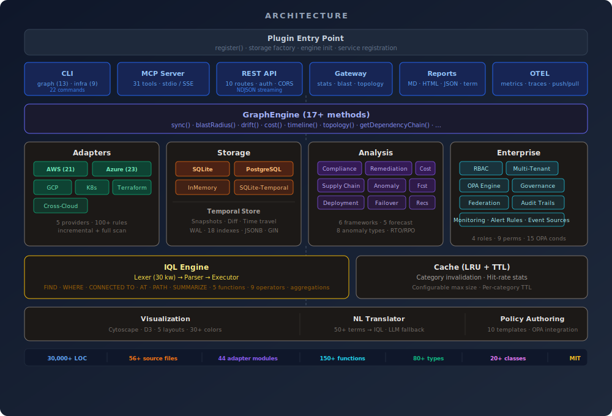

# @infra-graph/core

**Infrastructure Knowledge Graph** — scan, query, and analyze cloud infrastructure across AWS, Azure, GCP, and Kubernetes. 31 AI-agent tools, a purpose-built query language (IQL), compliance across 6 frameworks, and an MCP server for Claude Desktop, Cursor, Windsurf, and any MCP-compatible client.

<p align="center">
  
</p>

| Capability | Details |
|------------|---------|
| **Cloud Scanning** | AWS (59 resource types, 21 sub-modules), Azure (60+, 23 sub-modules), GCP (40+), Kubernetes (16 kinds), Terraform (100+ mappings) |
| **Cross-Cloud** | 5 built-in rules: VPN/peering, shared DNS, federated identity, AI workloads, shared storage |
| **IQL Query Language** | `FIND resources WHERE type = 'ec2' AND tag.env = 'prod'` — full lexer/parser/executor, 5 built-in functions, temporal `AT` |
| **31 AI Tools** | Blast radius, SPOF, drift, cost, compliance, remediation, supply chain, anomaly detection, visualization, benchmarks |
| **6 Compliance Frameworks** | SOC 2, HIPAA, PCI-DSS, ISO 27001, NIST 800-53, CIS Benchmarks — 30+ concrete controls |
| **MCP Server** | Native integration with Claude Desktop, Cursor, Windsurf, Cody, Continue |
| **REST API** | 10 endpoints with Bearer auth, rate limiting, CORS, NDJSON streaming |
| **Storage Backends** | InMemory, SQLite (WAL, 18 indexes), PostgreSQL (JSONB, materialized views), SQLite-Temporal |
| **Enterprise** | RBAC (4 roles, 9 permissions), multi-tenancy (4 isolation modes), OPA policy engine (15 condition types), federation, governance workflows |
| **Observability** | OTEL metrics + traces (push/pull), 3 Grafana dashboards, continuous monitoring, webhook receiver |
| **GitHub Action** | CI/CD compliance scanning with PR comments, threshold enforcement, 11 inputs, 6 outputs |

---

## Table of Contents

- [Quick Start](#quick-start)
- [Status](#status)
- [Architecture](#architecture)
- [Cloud Adapters](#cloud-adapters)
- [IQL — Infrastructure Query Language](#iql--infrastructure-query-language)
- [MCP Server & AI Tools (31)](#mcp-server--ai-tools-31)
- [REST API (10 Endpoints)](#rest-api-10-endpoints)
- [CLI Commands (22)](#cli-commands-22)
- [Compliance Frameworks (6)](#compliance-frameworks-6)
- [Governance & Risk Scoring](#governance--risk-scoring)
- [RBAC & Multi-Tenancy](#rbac--multi-tenancy)
- [OPA Policy Engine](#opa-policy-engine)
- [Temporal & Time Travel](#temporal--time-travel)
- [Federation](#federation)
- [Cost Analysis & Forecasting](#cost-analysis--forecasting)
- [Remediation & IaC Patches](#remediation--iac-patches)
- [Supply Chain Security](#supply-chain-security)
- [Anomaly Detection](#anomaly-detection)
- [Deployment Impact Analysis](#deployment-impact-analysis)
- [Failover Mapping](#failover-mapping)
- [Visualization](#visualization)
- [Monitoring & Webhooks](#monitoring--webhooks)
- [Observability (OTEL)](#observability-otel)
- [Reporting & Export](#reporting--export)
- [Storage Backends](#storage-backends)
- [Graph Algorithms](#graph-algorithms)
- [Cache](#cache)
- [Benchmarks](#benchmarks)
- [Natural Language → IQL](#natural-language--iql)
- [Policy Authoring](#policy-authoring)
- [GitHub Action](#github-action)
- [Grafana Dashboards](#grafana-dashboards)
- [Programmatic Usage](#programmatic-usage)
- [Node ID Format](#node-id-format)
- [Package Exports](#package-exports)
- [File Structure](#file-structure)
- [Testing](#testing)
- [Design Decisions](#design-decisions)
- [Contributing](#contributing)

---

## Quick Start

### Install

```bash
npm install -g @infra-graph/core
```

### Scan Infrastructure

```bash
# From Terraform state (no cloud credentials needed)
infra-graph infra scan --terraform ./terraform.tfstate

# From live AWS
infra-graph infra cloud-scan --aws --aws-region us-east-1 --db ./infra.db

# Multi-cloud (all at once)
infra-graph infra cloud-scan --aws --azure --gcp --db ./infra.db

# Kubernetes cluster
infra-graph infra cloud-scan --kubernetes --db ./infra.db
```

### Query with IQL

```bash
infra-graph infra query --db ./infra.db "FIND resources WHERE type = 'ec2' AND tag.env = 'prod'"
```

### Run Compliance

```bash
infra-graph infra compliance --db ./infra.db --framework hipaa
```

### MCP Server (Claude Desktop, Cursor, etc.)

```bash
infra-graph mcp --db ./infra.db
```

Add to `~/.claude/claude_desktop_config.json`:

```json
{
  "mcpServers": {
    "infra-graph": {
      "command": "npx",
      "args": ["@infra-graph/core", "mcp", "--db", "~/.infra-graph/graph.db"]
    }
  }
}
```

Then ask your AI assistant: *"What's the blast radius if I delete this VPC?"*

### REST API Server

```bash
infra-graph serve --db ./infra.db --port 3000 --api-key my-secret
```

---

## Status

> **30,000+ LOC** of source across 56+ files + 44 adapter sub-modules · **1,422 tests passing** · **0 type errors**

| Layer | Status | Notes |
|-------|--------|-------|
| **Core types** | Production | 50 resource types, 43 relationship types, 9 node statuses |
| **GraphEngine** | Production | 17+ methods: sync, blast radius, dependency chains, drift, cost, topology, timeline |
| **Graph queries** | Production | Shortest path, orphans, SPOFs (Tarjan's), clusters, critical nodes |
| **IQL query language** | Production | Lexer (30 keywords) + parser + executor, `FIND`/`WHERE`/`CONNECTED TO`/`AT`/aggregations |
| **MCP server** | Production | 31 tools, stdio transport, full tool registry |
| **REST API** | Production | 10 endpoints, Bearer auth, rate limiting, CORS, NDJSON streaming |
| **CLI** | Production | 22 commands across `espada graph` (13) + `espada infra` (9) + standalone |
| **SQLite storage** | Production | WAL mode, recursive CTE traversal, 18 indexes, JSONB metadata |
| **PostgreSQL storage** | Production | JSONB queries, materialized views, GIN indexes, schema-based multi-tenancy |
| **SQLite-Temporal** | Production | Point-in-time snapshots, time travel queries, temporal diffing |
| **InMemory storage** | Production | BFS traversal, full interface parity, ideal for tests |
| **Compliance** | Production | 6 frameworks (SOC 2, HIPAA, PCI-DSS, ISO 27001, NIST 800-53, CIS), 30+ controls |
| **Governance** | Production | 7-factor risk scoring, approval workflows, audit trails |
| **RBAC** | Production | 4 roles, 9 permissions, scoped access |
| **Multi-tenancy** | Production | 4 isolation modes (schema, row, database, namespace) |
| **OPA engine** | Production | 15 condition types, Rego subset parser, auto-remediation |
| **Temporal** | Production | Snapshots, time travel, diffing, evolution summaries |
| **Federation** | Production | Multi-cluster, peer discovery, conflict resolution (LWW/merge/custom) |
| **Monitoring** | Production | CloudTrail/Azure/GCP event sources, 5 alert rules, mock mode |
| **AWS adapter** | Production | 2,096 LOC orchestrator + 21 sub-modules, 50+ relationship rules, 15 discovery phases |
| **Azure adapter** | Production | 1,880 LOC + 23 sub-modules, 60+ resource mappings, Resource Graph KQL |
| **GCP adapter** | Production | 862 LOC, 40+ resource mappings, Cloud Asset Inventory API |
| **Kubernetes adapter** | Production | 1,146 LOC, 16 kind mappings, Helm release detection |
| **Terraform adapter** | Production | 1,207 LOC, 100+ resource type mappings, HCL state parsing |
| **Cross-cloud adapter** | Production | 488 LOC, 5 rules for multi-cloud relationship discovery |
| **Cost forecasting** | Production | 5 methods: linear regression, exponential smoothing, seasonal, moving average, ML-ready |
| **Remediation** | Production | 4 IaC formats (Terraform, CloudFormation, Pulumi, Ansible), 5 provider maps |
| **Supply chain** | Production | SBOM parsing (CycloneDX/SPDX), CVE tracking, dependency graph |
| **Anomaly detection** | Production | 8 types: cost spike, config change, topology, compliance, performance, security, drift, access |
| **Visualization** | Production | Cytoscape + D3-force layouts, 5 strategies, 30+ color mappings |
| **OTEL export** | Production | Metrics + traces, push/pull modes |
| **Reporting** | Production | Terminal, Markdown, HTML, JSON + export: JSON, DOT, Mermaid, YAML, CSV, OpenLineage |
| **Benchmarks** | Production | 18 measurements at 1K/10K/100K scale |
| **GitHub Action** | Production | CI/CD compliance scanning with PR comments |
| **Grafana dashboards** | Production | 3 dashboards: compliance scores, cost trends, drift velocity |

---

## Architecture

<p align="center">
  
</p>

---

## Cloud Adapters

### Adapter Feature Matrix

| Feature | AWS | Azure | GCP | K8s | Terraform |
|---------|-----|-------|-----|-----|-----------|
| Resource discovery | ✅ 59 types | ✅ 60+ types | ✅ 40+ types | ✅ 16 kinds | ✅ 100+ mappings |
| Relationship extraction | 50+ rules | ~20 rules | 12 rules | 16 mappings | 100+ mappings |
| Sub-modules | 21 | 23 | — | — | — |
| Incremental sync | ✅ CloudTrail | ❌ Full rescan | ❌ Full rescan | ❌ Full rescan | ❌ Full rescan |
| Live cost data | ✅ Cost Explorer | ✅ Cost enrichment | ❌ Static | ❌ | ❌ |
| Security posture | ✅ SecurityHub + GuardDuty | ✅ Security Center | ❌ | ❌ | ❌ |
| Cost forecasting | ✅ ML-ready | ❌ | ❌ | ❌ | ❌ |
| Optimization recs | ✅ Rightsizing + RI | ❌ | ❌ | ❌ | ❌ |
| Organization | ✅ Accounts, OUs, SCPs | ✅ Subscriptions, Mgmt Groups | ✅ Projects | ✅ Namespaces | — |
| Backup discovery | ✅ Backup vaults | ✅ Recovery vaults | ❌ | ❌ | — |
| CI/CD discovery | ✅ CodePipeline/Build/Deploy | ✅ DevOps/Automation | ❌ | ❌ | — |
| AI/ML services | ✅ SageMaker, Bedrock | ✅ Cognitive Services | ✅ Vertex AI, TPU | ❌ | — |
| DNS | ✅ Route53 | ✅ Azure DNS | ❌ | ❌ | — |
| Helm detection | — | — | — | ✅ | — |

### AWS Adapter (21 Sub-modules)

The AWS adapter uses a phased discovery approach with 15 discovery phases:

```
src/adapters/aws/
├── index.ts           # Module re-exports
├── types.ts           # AwsAdapterConfig, AwsClient, AwsForecastResult, ...
├── constants.ts       # 50+ relationship rules, cost tables, service mappings
├── utils.ts           # Field resolution, ID extraction, node matching
├── context.ts         # AwsAdapterContext interface for module delegation
├── compute.ts         # EC2 deeper: ASGs, Load Balancers, Target Groups
├── database.ts        # ElastiCache + RDS deeper discovery
├── containers.ts      # ECS/EKS deeper discovery
├── organization.ts    # AWS Organization: accounts, OUs, SCPs
├── backup.ts          # AWS Backup vaults, plans, protected resources
├── automation.ts      # EventBridge rules, Step Functions
├── cicd.ts            # CodePipeline, CodeBuild, CodeDeploy
├── cognito.ts         # User Pools, Identity Pools, App Clients
├── network.ts         # VPC peering, Transit GW, NACLs, endpoints
├── dynamodb.ts        # Tables, GSIs, global tables, backups
├── apigateway.ts      # REST/HTTP APIs, stages, integrations
├── messaging.ts       # SQS enrichment, SNS fanout
├── route53-dns.ts     # Hosted zones, aliases, health checks
├── enrichment.ts      # Tags, events, observability, compliance
├── cost.ts            # Forecasting, optimization, unused detection
└── security.ts        # Security posture, GuardDuty, CloudTrail
```

**15 Discovery Phases:** Core services → IAM → S3/Storage → VPC/Networking → Lambda/Serverless → RDS/Database → SQS/SNS → CloudFront/CDN → ElastiCache → ECS/Containers → Organization → Backup → Automation/CI/CD → Cognito → Network/DynamoDB/API Gateway/Messaging/Route53/Security deeper enrichment

### Azure Adapter (23 Sub-modules)

Uses Azure Resource Graph (KQL) for initial discovery, then per-service enrichment:

| Module | Capabilities |
|--------|-------------|
| `compute.ts` | VMs, Scale Sets, Availability Sets |
| `containers.ts` | AKS, ACI, ACR |
| `serverless.ts` | Functions, Web Apps, Spring Apps, Static Web Apps |
| `network.ts` | VNets, NSGs, Load Balancers, Public IPs, Firewalls, App Gateway, Front Door |
| `database.ts` | SQL, CosmosDB, Redis, MySQL/PostgreSQL Flexible Server |
| `storage.ts` | Storage Accounts, Blob, File, Queue, Table |
| `messaging.ts` | Service Bus, Event Hubs, Event Grid |
| `security.ts` | Key Vault, Security Center, IAM |
| `dns.ts` | Azure DNS zones, records |
| `backup.ts` | Recovery Services vaults |
| `ai.ts` | Cognitive Services |
| `cdn.ts` | CDN profiles, endpoints |
| `governance.ts` | Azure Policy, compliance assessments |
| `devops.ts` | Azure DevOps, Automation Accounts |
| `integration.ts` | API Management, Logic Apps, Data Factory |
| `platform.ts` | Resource Groups, Subscriptions, Management Groups |
| `analytics.ts` | Synapse, Purview |
| `hybrid.ts` | Arc Servers, Arc K8s, HCI, Bastion, Traffic Manager |
| `iot.ts` | SignalR, Digital Twins, Notification Hubs, Maps |
| `enrichment.ts` | Cost data, Monitoring, Activity Log, Tags |
| `utils.ts` | Node ID building, edge helpers, status mapping |

### GCP Adapter

Uses Cloud Asset Inventory API. Resource categories: Compute (VMs, Instance Groups, Templates), Containers (GKE, Cloud Run, Artifact Registry), Serverless (Cloud Functions, App Engine), Networking (VPCs, Subnets, Firewalls, Cloud NAT, Cloud Armor, Interconnect), Database (Cloud SQL, Spanner, Bigtable, Firestore, Memorystore), Storage (GCS, Filestore), Messaging (Pub/Sub), Security (KMS, Secret Manager, IAM), API (API Gateway, Endpoints), CDN, AI/ML (Vertex AI, AI Platform, TPU).

### Kubernetes Adapter

Direct K8s API + Helm release detection. Discovers 16 resource kinds:

| Kind | Maps To | Kind | Maps To |
|------|---------|------|---------|
| Deployment | `container` | PVC | `volume` |
| StatefulSet | `container` | PV | `volume` |
| DaemonSet | `container` | ServiceAccount | `identity` |
| Service | `service` | NetworkPolicy | `firewall` |
| Ingress | `ingress` | HPA | `automation` |
| ConfigMap | `config` | CronJob | `automation` |
| Secret | `secret` | Job | `automation` |
| Pod | `pod` | Namespace | `namespace` |

System namespaces (`kube-system`, `kube-public`, `kube-node-lease`) are automatically filtered.

### Cross-Cloud Adapter

5 built-in rules for detecting multi-cloud relationships:

| Rule | Detects |
|------|---------|
| VPN/Peering | VPN/peering between VPCs/VNets (naming, tags, CIDR overlap) |
| Shared DNS | DNS records resolving across clouds |
| Federated Identity | IAM trust across providers (google.com, sts.windows.net, amazonaws.com) |
| Cross-Cloud AI | AI workloads spanning clouds (model name matching, same owner) |
| Shared Storage | Cross-cloud storage references (s3://, gs://, .blob.core.windows.net) |

All rules apply to every provider pair: AWS↔Azure, AWS↔GCP, Azure↔GCP.

---

## IQL — Infrastructure Query Language

A purpose-built query language with a full lexer (30 keywords), parser (AST builder), and executor.

### Query Types

```sql
-- FIND: resource discovery
FIND compute WHERE status = "running" AND tags.env = "production"

-- CONNECTED TO: graph traversal
FIND database CONNECTED TO vpc WHERE nativeId = "vpc-abc123"

-- DOWNSTREAM/UPSTREAM: dependency chains
FIND DOWNSTREAM OF 'vpc-abc123'

-- PATH: shortest path
FIND PATH FROM 'vpc-prod' TO 'rds-primary'

-- AT: temporal time travel
FIND * AT "2024-01-15T00:00:00Z"

-- SUMMARIZE: aggregations
SUMMARIZE cost BY type

-- DIFF: temporal comparison
FIND resources DIFF WITH '2025-01-01T00:00:00Z'
```

### Operators (9)

`=`, `!=`, `>`, `<`, `>=`, `<=`, `LIKE`, `IN`, `MATCHES`

Boolean: `AND`, `OR`, `NOT`

### Built-in Functions (5)

| Function | Description |
|----------|-------------|
| `tagged(key)` | Resources with a specific tag |
| `drifted_since(timestamp)` | Resources that drifted after a timestamp |
| `has_edge(type)` | Resources with a specific edge type |
| `created_after(timestamp)` | Resources created after a timestamp |
| `created_before(timestamp)` | Resources created before a timestamp |

### Aggregations

`SUM()`, `AVG()`, `MIN()`, `MAX()`, `COUNT`, `GROUP_BY()`

### Programmatic Usage

```typescript
import { Lexer, Parser, IQLExecutor } from "@infra-graph/core/iql";

const tokens = new Lexer("FIND compute WHERE status = 'running'").tokenize();
const ast = new Parser(tokens).parse();
const results = await new IQLExecutor(storage).execute(ast);
```

---

## MCP Server & AI Tools (31)

The MCP server exposes 31 tools via stdio transport for any MCP-compatible AI client.

### Core Graph (9 tools)

| Tool | Description |
|------|-------------|
| `kg_blast_radius` | Blast radius of changing/removing a resource (depth, cost impact) |
| `kg_dependencies` | Dependency chain — upstream, downstream, or both |
| `kg_cost` | Cost attribution by resource, type, or provider |
| `kg_drift` | Configuration drift detection with field-level diffing |
| `kg_spof_analysis` | Single Point of Failure detection (Tarjan's algorithm) |
| `kg_path` | Shortest path between two resources |
| `kg_orphans` | Orphaned/unattached resources |
| `kg_status` | Graph statistics (nodes, edges, providers, types) |
| `kg_export` | Export graph (JSON, DOT/Graphviz, Mermaid) |

### Governance & Temporal (10 tools)

| Tool | Description |
|------|-------------|
| `kg_audit_trail` | Query change audit trail with filters |
| `kg_request_change` | Submit change request with automatic 7-factor risk scoring |
| `kg_governance_summary` | Governance dashboard: pending, approved, rejected, risk distribution |
| `kg_pending_approvals` | List pending approval requests |
| `kg_time_travel` | View graph state at any point in time |
| `kg_diff` | Diff between two snapshots (added/removed/modified) |
| `kg_node_history` | Per-resource change history |
| `kg_evolution` | Infrastructure evolution trends and growth analysis |
| `kg_snapshot` | Create a manual named snapshot |
| `kg_list_snapshots` | Browse available snapshots |

### Analysis (12 tools)

| Tool | Description |
|------|-------------|
| `kg_query` | Execute IQL queries |
| `kg_compliance` | Compliance assessment (SOC 2, HIPAA, PCI-DSS, ISO 27001, NIST, CIS) |
| `kg_recommendations` | Optimization recommendations (7 categories) |
| `kg_agents` | Agent activity report (actions, costs, models) |
| `kg_ask` | Natural language → IQL translation (50+ term dictionary) |
| `kg_remediation` | Generate IaC patches (Terraform/CloudFormation/Pulumi/Ansible) |
| `kg_supply_chain` | Supply chain security: SBOM, CVE tracking, dependency graph |
| `kg_visualize` | Graph visualization (Cytoscape/D3, 5 layout strategies) |
| `kg_rbac` | RBAC policy management |
| `kg_benchmark` | Performance benchmarks at 1K/10K/100K scale |
| `kg_export_extended` | Extended export (YAML, CSV, OpenLineage) |
| `kg_policy_scan` | Cross-extension OPA policy evaluation |

---

## REST API (10 Endpoints)

Start the server: `infra-graph serve --db ./infra.db --port 3000 --api-key my-secret`

**Security:** Bearer token authentication, rate limiting, CORS support, Helmet security headers.

| Method | Path | Description |
|--------|------|-------------|
| `GET` | `/v1/graph/stats` | Graph statistics (nodes, edges, providers) |
| `GET` | `/v1/graph/topology` | Full topology; supports `?stream=true` for NDJSON streaming |
| `GET` | `/v1/graph/nodes/:id` | Single node with edges |
| `GET` | `/v1/graph/blast-radius/:id` | Blast radius analysis |
| `POST` | `/v1/graph/query` | Execute IQL query (`{ "query": "FIND ..." }`) |
| `POST` | `/v1/graph/compliance` | Compliance assessment (`{ "framework": "hipaa" }`) |
| `GET` | `/v1/graph/export` | Export graph (format: json/dot/mermaid) |
| `GET` | `/health` | Health check |
| `GET` | `/v1/graph/cost` | Cost analysis |
| `GET` | `/v1/graph/drift` | Drift detection |

### NDJSON Streaming

For large topologies, use `?stream=true` on the topology endpoint:

```bash
curl -H "Authorization: Bearer $KEY" \
  "http://localhost:3000/v1/graph/topology?stream=true"
```

Each line is a JSON object: `{"type":"node","data":{...}}` or `{"type":"edge","data":{...}}`.

---

## CLI Commands (22)

### `espada graph` — Graph Management (13 commands)

| Command | Description |
|---------|-------------|
| `espada graph status` | Graph statistics |
| `espada graph blast-radius <id>` | Blast radius analysis |
| `espada graph dependencies <id>` | Dependency chain |
| `espada graph drift` | Configuration drift detection |
| `espada graph cost` | Cost attribution |
| `espada graph spof` | Single Point of Failure analysis |
| `espada graph export` | Export (JSON/DOT/Mermaid) |
| `espada graph compliance` | Compliance assessment |
| `espada graph query <iql>` | Execute IQL query |
| `espada graph snapshot` | Create snapshot |
| `espada graph diff` | Compare snapshots |
| `espada graph timeline` | Node change history |
| `espada graph remediate` | Generate remediation patches |

### `espada infra` — Infrastructure Operations (9 commands)

| Command | Description |
|---------|-------------|
| `espada infra scan` | Scan from Terraform state |
| `espada infra cloud-scan` | Live cloud discovery (AWS/Azure/GCP/K8s) |
| `espada infra query` | Execute IQL query |
| `espada infra compliance` | Compliance assessment |
| `espada infra topology` | View topology |
| `espada infra report` | Generate report |
| `espada infra supply-chain` | Supply chain analysis |
| `espada infra benchmark` | Run performance benchmarks |
| `espada infra recommendations` | Optimization recommendations |

### Standalone `infra-graph` Binary

| Command | Description |
|---------|-------------|
| `infra-graph mcp` | Start MCP server (stdio transport) |
| `infra-graph serve` | Start REST API server |

---

## Compliance Frameworks (6)

Each framework evaluates concrete controls with per-resource pass/fail/warning results and auto-generated remediation guidance.

| Framework | Controls | Key Checks |
|-----------|----------|------------|
| **SOC 2** | CC6.1, CC6.6, CC7.2, CC8.1 | Encryption at rest, network isolation, logging, change management |
| **HIPAA** | §164.312(a)(1), §164.312(b), §164.312(e)(1) | Access controls, **audit-grade logging** (not just access logs), encryption in transit |
| **PCI-DSS** | PCI-1.1, PCI-3.4, PCI-6.5, PCI-10.2 | Firewall config, data encryption, secure development, **audit trail logging** |
| **ISO 27001** | A.9.1, A.10.1, A.12.4, A.13.1 | Access control, cryptography, logging, network security |
| **NIST 800-53** | AC-2, SC-7, AU-2, CM-6 | Account management, boundary protection, audit events, config settings |
| **CIS Benchmarks** | CIS-2.1, CIS-3.1, CIS-4.1 | Storage encryption, network controls, logging config |

**Strict network isolation**: Resources with no network metadata (`vpcId`, `subnetId`, `privateIp`) or edges (`runs-in`, `secured-by`) **fail** network controls — no optimistic pass for missing data.

**Audit vs. access logging**: HIPAA and PCI-DSS distinguish between audit-grade logging (`auditLogging`, `cloudTrailEnabled`, `queryLogging`) and general access logging. General logging triggers a "warning" rather than a "pass".

### Batch Evaluation

Compliance evaluation uses `batchBuildContexts()` to load all edges in parallel, eliminating N+1 queries for large graphs.

---

## Governance & Risk Scoring

### 7-Factor Risk Scoring

| Factor | Weight | Example |
|--------|--------|---------|
| Resource criticality | High | Production databases score higher |
| Blast radius size | High | Changes affecting 50+ resources |
| Data sensitivity | Medium | PII, financial data |
| Compliance impact | Medium | HIPAA-regulated resources |
| Change frequency | Low | Rarely-changed resources score higher |
| Rollback complexity | Medium | Schema migrations vs config changes |
| Time-of-day risk | Low | Changes during business hours |

**Thresholds:** Score ≤30 → auto-approve, 31–69 → manual review, ≥70 → auto-block

### Governance Workflow

```typescript
// Submit a change request
const request = await governance.requestChange({
  resourceId: "aws:123:us-east-1:database:prod-rds",
  changeType: "modify",
  description: "Scale RDS to db.r5.4xlarge",
  requestedBy: "engineer@company.com"
});
// → { id, riskScore: 45, status: "pending", factors: [...] }

// Approve/reject
await governance.approveChange(request.id, "admin@company.com", "Approved for maintenance window");

// Query audit trail
const trail = await governance.getAuditTrail({ resourceId: "...", since: "2025-01-01" });
```

---

## RBAC & Multi-Tenancy

### RBAC (4 Roles, 9 Permissions)

| Role | Permissions |
|------|------------|
| `admin` | All 9 permissions |
| `operator` | read, write, execute, approve |
| `analyst` | read, execute, export |
| `viewer` | read only |

**Permissions:** `read`, `write`, `delete`, `execute`, `approve`, `admin`, `export`, `configure`, `audit`

All permissions support scope-based access control (by tenant, provider, resource type).

### Multi-Tenancy (4 Isolation Modes)

| Mode | Description |
|------|-------------|
| `schema` | PostgreSQL schema-per-tenant |
| `row` | Row-level security with tenant ID column |
| `database` | Separate database per tenant |
| `namespace` | Logical namespace separation |

---

## OPA Policy Engine

15 condition types with a Rego subset parser for custom policy evaluation.

### Condition Types

`equals`, `not_equals`, `contains`, `not_contains`, `greater_than`, `less_than`, `matches_regex`, `exists`, `not_exists`, `in_list`, `not_in_list`, `starts_with`, `ends_with`, `between`, `type_check`

### Example Policy

```typescript
const policy = {
  id: "enforce-encryption",
  name: "Require encryption at rest",
  rules: [{
    field: "metadata.encrypted",
    condition: "equals",
    value: true,
    severity: "critical"
  }],
  enforcement: "block",       // block | warn | audit
  autoRemediate: true
};
```

---

## Temporal & Time Travel

### Capabilities

| Feature | Description |
|---------|-------------|
| Snapshots | Named point-in-time captures of full graph state |
| Time travel | Query graph as it existed at any timestamp (`FIND * AT "2024-01-15"`) |
| Diffing | Structural diff between two snapshots (added, removed, modified nodes/edges) |
| Evolution | Growth trends, churn rate, provider distribution over time |
| Node history | Per-resource change timeline with field-level diffs |

### Programmatic Usage

```typescript
// Create snapshot
await temporal.createSnapshot("pre-migration", engine);

// Time travel
const pastState = await temporal.getGraphAt("2024-06-01T00:00:00Z");

// Diff
const diff = await temporal.diffSnapshots("pre-migration", "post-migration");
// → { added: [...], removed: [...], modified: [{ nodeId, changes: [...] }] }

// Evolution
const evolution = await temporal.getEvolution({ period: "30d" });
// → { snapshots: [...], growth: { nodes: +15%, edges: +22% }, churn: 0.03 }
```

---

## Federation

Multi-cluster federation with peer discovery and conflict resolution.

| Feature | Description |
|---------|-------------|
| Peer discovery | Automatic discovery of federation peers |
| State sync | Incremental graph synchronization across clusters |
| Conflict resolution | Last-Writer-Wins (LWW), merge, or custom strategies |
| Partition tolerance | Split-brain detection and recovery |
| Cross-cluster queries | Federated IQL queries spanning multiple clusters |

---

## Cost Analysis & Forecasting

### Cost Attribution

- Per-resource, per-type, per-provider cost breakdown
- Shared resource cost allocation (4 methods: equal split, weighted, tag-based, usage-based)
- Agent cost tracking: model usage, API calls, token consumption
- Cost anomaly detection with configurable thresholds

### 5 Forecasting Methods

| Method | Description |
|--------|-------------|
| Linear regression | Trend-based projection |
| Exponential smoothing | Weighted recent history |
| Seasonal decomposition | Pattern-aware (weekly/monthly cycles) |
| Moving average | Smoothed recent trends |
| ML-ready pipeline | Feature extraction for custom models |

```typescript
const forecast = await engine.forecastCosts({
  method: "seasonal",
  horizon: "90d",
  confidence: 0.95
});
// → { projected: [...], upperBound: [...], lowerBound: [...] }
```

---

## Remediation & IaC Patches

Auto-generate infrastructure-as-code patches to fix compliance violations.

### 4 Output Formats

| Format | Example |
|--------|---------|
| **Terraform** | `resource "aws_s3_bucket" { server_side_encryption_configuration { ... } }` |
| **CloudFormation** | YAML template with `AWS::S3::Bucket` properties |
| **Pulumi** | TypeScript/Python resource definitions |
| **Ansible** | Playbook tasks with `amazon.aws` modules |

### 5 Provider Maps

Each provider has remediation mappings for common violations: AWS, Azure, GCP, Kubernetes, generic.

**DriftedField** tracking includes: field path, expected value, actual value — enabling precise, targeted patches.

---

## Supply Chain Security

| Feature | Description |
|---------|-------------|
| SBOM parsing | CycloneDX and SPDX format support |
| CVE tracking | Known vulnerability correlation |
| Dependency graph | Software dependency relationship mapping |
| License analysis | License compliance checking |
| Provenance | Build provenance and attestation tracking |

---

## Anomaly Detection

8 anomaly types with configurable sensitivity:

| Type | Detects |
|------|---------|
| `cost_spike` | Unusual cost increases (threshold-based) |
| `config_change` | Unexpected configuration modifications |
| `topology_change` | Structural graph changes (new/removed connections) |
| `compliance_drift` | Compliance score degradation |
| `performance` | Performance metric anomalies |
| `security` | Security posture changes |
| `drift` | Configuration drift from desired state |
| `access_pattern` | Unusual access patterns |

---

## Deployment Impact Analysis

Pre-deployment risk assessment:

```typescript
const impact = await engine.analyzeDeploymentImpact({
  changes: [
    { resourceId: "vpc-abc123", action: "modify", fields: { cidrBlock: "10.1.0.0/16" } }
  ]
});
// → { riskScore, affectedResources, blastRadius, complianceImpact, rollbackPlan }
```

---

## Failover Mapping

Automatic failover path discovery with RTO/RPO estimation:

```typescript
const failover = await engine.getFailoverMap("aws:123:us-east-1:database:prod-rds");
// → { primary, replicas, failoverPaths, estimatedRTO: "< 5 min", estimatedRPO: "< 1 min" }
```

---

## Visualization

### 2 Output Formats

| Format | Description |
|--------|-------------|
| **Cytoscape** | Full Cytoscape.js-compatible JSON with styles and layout |
| **D3-force** | D3 force-directed graph JSON |

### 5 Layout Strategies

`hierarchical`, `circular`, `force-directed`, `grid`, `concentric`

### 30+ Color Mappings

Resources are color-coded by type (compute=blue, database=green, network=purple, security=red, storage=orange, etc.), with status-based opacity.

---

## Monitoring & Webhooks

### Continuous Monitoring

3 cloud event sources for real-time change detection:

| Source | Cloud | Events |
|--------|-------|--------|
| CloudTrail | AWS | API calls, resource changes |
| Activity Log | Azure | Resource modifications |
| Audit Log | GCP | Admin and data access events |

5 built-in alert rules with configurable thresholds and notification channels.

### Webhook Receiver

4 provider-specific routes with HMAC signature verification:

| Route | Provider | Verification |
|-------|----------|-------------|
| `/webhooks/aws` | AWS SNS | Signature v1 |
| `/webhooks/azure` | Azure Event Grid | Validation handshake |
| `/webhooks/gcp` | GCP Pub/Sub | JWT verification |
| `/webhooks/github` | GitHub | HMAC-SHA256 |

---

## Observability (OTEL)

OpenTelemetry export for metrics and traces.

### Metrics

- `infra_graph.nodes.total` — Total node count (gauge)
- `infra_graph.edges.total` — Total edge count (gauge)
- `infra_graph.sync.duration` — Sync duration (histogram)
- `infra_graph.compliance.score` — Compliance score per framework (gauge)
- `infra_graph.drift.count` — Drift detection count (counter)
- `infra_graph.cost.total` — Total infrastructure cost (gauge)

### Export Modes

| Mode | Description |
|------|-------------|
| Push (OTLP) | Export to any OTLP-compatible collector (Grafana, Datadog, New Relic) |
| Pull (Prometheus) | Expose `/metrics` endpoint for scraping |

```bash
# Push to OTLP collector
infra-graph infra cloud-scan --aws --otel-endpoint https://collector.example.com --otel-api-key $KEY

# Pull mode
infra-graph serve --db ./infra.db --metrics-port 9090
```

---

## Reporting & Export

### 4 Report Formats

| Format | Description |
|--------|-------------|
| Terminal | Colored table output for CLI |
| Markdown | `.md` file with tables and summaries |
| HTML | Standalone HTML report with embedded styles |
| JSON | Machine-readable structured output |

### 6 Export Formats

| Format | Description |
|--------|-------------|
| JSON | Full graph serialization |
| DOT | Graphviz DOT language |
| Mermaid | Mermaid diagram syntax |
| YAML | Structured YAML export |
| CSV | Tabular export (nodes and edges) |
| OpenLineage | OpenLineage-compatible lineage events |

---

## Storage Backends

### InMemory

Zero-config, ideal for tests and ephemeral operations. BFS traversal, full `GraphStorage` interface parity.

### SQLite

Production-grade embedded storage:
- WAL mode for concurrent reads
- 18 indexes for optimized queries
- Recursive CTE for graph traversal
- JSONB metadata columns
- Full-text search capabilities

### PostgreSQL

Enterprise multi-tenant storage:
- JSONB queries with GIN indexes
- Materialized views for topology aggregation
- Schema-based tenant isolation
- Connection pooling
- Upsert with conflict resolution

### SQLite-Temporal

Extends SQLite with temporal capabilities:
- Point-in-time snapshots
- Temporal range queries
- Snapshot diffing
- Evolution tracking

### GraphStorage Interface (30+ methods)

Key methods: `addNode`, `getNode`, `updateNode`, `deleteNode`, `addEdge`, `getEdge`, `updateEdge`, `deleteEdge`, `getEdgesForNode`, `getAllNodes`, `getAllEdges`, `getNeighbors`, `traverseGraph`, `findNodes`, `getNodesByProvider`, `getNodesByType`, `getNodesByStatus`, `getNodeCount`, `getEdgeCount`, `getProviders`, `getResourceTypes`, `getChanges`, `addChange`, `close`

---

## Graph Algorithms

| Algorithm | Function | Complexity |
|-----------|----------|------------|
| Shortest path | `shortestPath(storage, from, to)` | BFS O(V+E) |
| Orphan detection | `findOrphans(storage)` | O(V+E) |
| SPOF detection | `findSinglePointsOfFailure(storage)` | Tarjan's O(V+E) |
| Cluster detection | `findClusters(storage)` | Connected components O(V+E) |
| Critical nodes | `findCriticalNodes(storage)` | Betweenness centrality |

---

## Cache

LRU cache with TTL and category-based invalidation:

```typescript
const cache = new GraphCache({ maxSize: 1000, ttl: 300_000 }); // 5 min TTL

cache.set("blast:vpc-123", result, "blast-radius");
cache.get("blast:vpc-123"); // → result or undefined

// Invalidate by category
cache.invalidateCategory("blast-radius");

// Stats
cache.stats(); // → { hits: 142, misses: 23, hitRate: 0.86 }
```

---

## Benchmarks

18 measurements at three scale tiers (1K, 10K, 100K nodes):

| Measurement | Description |
|-------------|-------------|
| Node insert (batch) | Bulk node insertion throughput |
| Edge insert (batch) | Bulk edge insertion throughput |
| Node lookup | Single node retrieval by ID |
| Edge lookup | Edge retrieval for a node |
| BFS traversal | Breadth-first graph traversal |
| Blast radius | Impact analysis computation |
| IQL query (simple) | Basic FIND/WHERE query |
| IQL query (complex) | CONNECTED TO + aggregation |
| Compliance eval | Full framework evaluation |
| Snapshot creation | Point-in-time capture |
| Snapshot diff | Two-snapshot comparison |
| Export (JSON) | Full graph serialization |
| Export (DOT) | Graphviz generation |
| Sync (incremental) | Delta sync with hashing |
| SPOF detection | Tarjan's algorithm |
| Cluster detection | Connected components |
| Cost aggregation | Per-provider cost sum |
| Cache operations | Get/set/invalidate throughput |

---

## Natural Language → IQL

50+ term dictionary translating natural language to IQL:

```
"show me all databases"     → FIND database
"running servers in prod"   → FIND compute WHERE status = "running" AND tags.env = "production"
"what depends on vpc-123"   → FIND DOWNSTREAM OF 'vpc-123'
"path from A to B"          → FIND PATH FROM 'A' TO 'B'
```

Falls back to LLM-based translation when dictionary lookup fails (template-first approach for speed and reliability).

---

## Policy Authoring

10 template types for creating OPA policies without writing Rego:

| Template | Description |
|----------|-------------|
| `require-encryption` | Enforce encryption at rest |
| `require-tagging` | Require specific tags |
| `restrict-regions` | Limit allowed regions |
| `require-backup` | Enforce backup configuration |
| `network-isolation` | Require VPC/subnet placement |
| `require-logging` | Enforce audit logging |
| `restrict-public-access` | Block public exposure |
| `require-mfa` | Enforce MFA on identities |
| `cost-threshold` | Alert on cost exceeding budget |
| `require-ha` | Enforce high availability config |

---

## GitHub Action

**"Infra Graph — Scan & Compliance"** — automated CI/CD compliance scanning.

### Usage

```yaml
- uses: your-org/infra-graph-action@v1
  with:
    provider: aws
    regions: us-east-1,us-west-2
    compliance-framework: hipaa
    fail-on-critical: true
    min-compliance-score: 80
    terraform-state: ./terraform.tfstate
    pr-comment: true
  env:
    AWS_ACCESS_KEY_ID: ${{ secrets.AWS_ACCESS_KEY_ID }}
    AWS_SECRET_ACCESS_KEY: ${{ secrets.AWS_SECRET_ACCESS_KEY }}
```

### Inputs (11)

| Input | Required | Default | Description |
|-------|----------|---------|-------------|
| `provider` | yes | — | Cloud provider to scan |
| `regions` | no | — | Comma-separated regions |
| `compliance-framework` | no | `soc2` | Framework to evaluate |
| `fail-on-critical` | no | `true` | Fail if critical issues found |
| `min-compliance-score` | no | `70` | Minimum passing score |
| `terraform-state` | no | — | Path to terraform.tfstate |
| `otel-endpoint` | no | — | OTLP collector endpoint |
| `otel-api-key` | no | — | OTLP API key |
| `pr-comment` | no | `true` | Post results as PR comment |
| `db-path` | no | — | SQLite database path |
| `additional-args` | no | — | Extra CLI arguments |

### Outputs (6)

| Output | Description |
|--------|-------------|
| `compliance-score` | Overall score (0–100) |
| `total-nodes` | Resources discovered |
| `total-edges` | Relationships discovered |
| `critical-findings` | Critical compliance findings |
| `scan-duration` | Duration in seconds |
| `report-path` | Path to generated report |

---

## Grafana Dashboards

3 pre-built Grafana JSON dashboards in `src/dashboards/`:

| Dashboard | Description |
|-----------|-------------|
| `compliance-scores.json` | Compliance framework scores over time |
| `cost-trends.json` | Infrastructure cost trend visualization |
| `drift-velocity.json` | Drift detection metrics over time |

Import directly into Grafana. Pair with OTEL push mode for live data.

---

## Programmatic Usage

```typescript
import { GraphEngine } from "@infra-graph/core/engine";
import { SQLiteGraphStorage } from "@infra-graph/core/storage";
import { AwsDiscoveryAdapter, AzureDiscoveryAdapter } from "@infra-graph/core/adapters";
import { buildToolRegistry, McpServer } from "@infra-graph/core/mcp";
import { Lexer, Parser, IQLExecutor } from "@infra-graph/core/iql";

// 1. Setup
const storage = new SQLiteGraphStorage("./infra.db");
const engine = new GraphEngine(storage);

// 2. Register adapters
engine.registerAdapter(new AwsDiscoveryAdapter({
  accountId: "123456789",
  regions: ["us-east-1", "us-west-2"]
}));

// 3. Discover infrastructure
await engine.sync();

// 4. Blast radius
const blast = await engine.getBlastRadius("aws:123:us-east-1:vpc:vpc-abc", 3);

// 5. IQL query
const tokens = new Lexer("FIND database WHERE tags.env = 'prod'").tokenize();
const ast = new Parser(tokens).parse();
const results = await new IQLExecutor(storage).execute(ast);

// 6. Compliance
const compliance = await engine.evaluateCompliance("hipaa");

// 7. Cost forecasting
const forecast = await engine.forecastCosts({ method: "seasonal", horizon: "90d" });

// 8. Build MCP server
const tools = buildToolRegistry({ engine, storage });
const server = new McpServer(tools);
await server.start(); // stdio transport
```

---

## Node ID Format

All nodes use a deterministic canonical ID:

```
{provider}:{accountId}:{region}:{resourceType}:{nativeId}
```

Examples:
- `aws:123456789:us-east-1:compute:i-abc123`
- `azure:sub-id:eastus:database:my-sql-server`
- `gcp:project-id:us-central1:serverless-function:my-func`
- `kubernetes:cluster-id:default:deployment:nginx`
- `terraform:local::compute:aws_instance.web`

---

## Relationship Types (43)

| Type | Example |
|------|---------|
| `runs-in` | EC2 → VPC, Lambda → Subnet |
| `contains` | VPC → Subnet, Subnet → Instance |
| `depends-on` | App → Database |
| `secured-by` | EC2 → Security Group |
| `routes-to` | ALB → Target Group |
| `triggers` | S3 Event → Lambda |
| `publishes-to` | App → SQS Queue |
| `subscribes-to` | Lambda → SNS Topic |
| `replicates` | RDS Primary → Read Replica |
| `attached-to` | EBS Volume ↔ EC2 |
| `uses` | Lambda → IAM Role |
| `monitors` | CloudWatch → EC2 |
| `logs-to` | App → CloudWatch Logs |
| `load-balances` | ALB → Target instances |
| `backed-by` | CloudFront → S3 Origin |
| `encrypts-with` | S3 → KMS Key |
| `managed-by` | Arc machine → Azure |
| `peers-with` | VPC ↔ VPC (peering) |
| `federates-with` | IAM ↔ external IdP |
| `backs-up` | Backup vault → RDS |
| `dns-resolves` | Route53 → ALB |
| …and 22 more | See `src/types.ts` |

---

## Package Exports

```json
{
  ".":          "src/index.ts",
  "./types":    "src/types.ts",
  "./storage":  "src/storage/",
  "./engine":   "src/core/engine",
  "./adapters": "src/adapters/",
  "./mcp":      "src/mcp/",
  "./iql":      "src/iql/",
  "./api":      "src/api/",
  "./otel":     "src/reporting/otel-export"
}
```

---

## File Structure

```
extensions/knowledge-graph/
├── package.json                    # @infra-graph/core v1.0.0
├── tsconfig.json
├── espada.plugin.json              # Espada plugin manifest
├── action.yml                      # GitHub Action definition
├── README.md
├── src/
│   ├── index.ts                    # Package entry point / re-exports
│   ├── types.ts                    # Core types (50 resource, 43 relationship, 9 statuses)
│   ├── core/
│   │   └── engine.ts               # GraphEngine (17+ methods)
│   ├── iql/
│   │   ├── lexer.ts                # Tokenizer (30 keywords)
│   │   ├── parser.ts               # AST builder
│   │   ├── executor.ts             # Query executor (5 built-in functions)
│   │   └── types.ts                # IQL AST types
│   ├── storage/
│   │   ├── memory-store.ts         # InMemory backend
│   │   ├── sqlite-store.ts         # SQLite backend (WAL, 18 indexes)
│   │   ├── postgres-store.ts       # PostgreSQL backend (JSONB, GIN)
│   │   ├── sqlite-temporal-store.ts # SQLite-Temporal backend
│   │   └── index.ts
│   ├── adapters/
│   │   ├── types.ts                # GraphDiscoveryAdapter interface
│   │   ├── registry.ts             # Adapter registry
│   │   ├── aws.ts                  # AWS orchestrator (2,096 LOC)
│   │   ├── aws/                    # 21 AWS sub-modules
│   │   ├── azure.ts                # Azure adapter (1,880 LOC)
│   │   ├── azure/                  # 23 Azure sub-modules
│   │   ├── gcp.ts                  # GCP adapter (862 LOC)
│   │   ├── kubernetes.ts           # K8s adapter (1,146 LOC)
│   │   ├── terraform.ts            # Terraform adapter (1,207 LOC)
│   │   ├── cross-cloud.ts          # Cross-cloud rules (488 LOC)
│   │   └── index.ts
│   ├── analysis/
│   │   ├── compliance.ts           # 6 frameworks, 30+ controls
│   │   ├── remediation.ts          # 4 IaC formats, 5 provider maps
│   │   ├── recommendations.ts      # 7 recommendation categories
│   │   ├── supply-chain.ts         # SBOM, CVE, dependency graph
│   │   ├── anomaly.ts              # 8 anomaly types
│   │   ├── cost-forecast.ts        # 5 forecasting methods
│   │   ├── deployment-impact.ts    # Pre-deployment risk assessment
│   │   └── failover.ts             # Failover paths, RTO/RPO estimation
│   ├── mcp/
│   │   ├── server.ts               # MCP server (stdio transport)
│   │   ├── tool-registry.ts        # 30 tool definitions
│   │   └── index.ts
│   ├── api/
│   │   ├── server.ts               # REST API (10 endpoints, NDJSON streaming)
│   │   └── index.ts
│   ├── cli/
│   │   ├── graph-commands.ts       # 13 `espada graph` commands
│   │   └── infra-commands.ts       # 9 `espada infra` commands
│   ├── tools/
│   │   ├── agent-tools.ts          # 31 Espada agent tool definitions
│   │   └── policy-scan-tool.ts     # Cross-extension OPA bridge
│   ├── reporting/
│   │   ├── report.ts               # Terminal/MD/HTML/JSON reports
│   │   ├── export.ts               # JSON/DOT/Mermaid export
│   │   ├── export-extended.ts      # YAML/CSV/OpenLineage export
│   │   └── otel-export.ts          # OTEL metrics + traces
│   ├── monitoring/
│   │   ├── continuous.ts           # Event sources, alert rules
│   │   └── webhook-receiver.ts     # 4 provider webhook routes
│   ├── core/
│   │   ├── queries.ts              # Graph algorithms (5 algorithms)
│   │   ├── sync.ts                 # SHA-256 delta sync
│   │   ├── cache.ts                # LRU+TTL cache
│   │   └── benchmark.ts            # 18 performance measurements
│   ├── governance/
│   │   ├── governance.ts           # 7-factor risk scoring, approvals
│   │   ├── rbac.ts                 # 4 roles, 9 permissions
│   │   ├── opa-engine.ts           # OPA policy evaluation (15 conditions)
│   │   └── policy-authoring.ts     # 10 policy templates
│   ├── temporal/
│   │   ├── temporal.ts             # Snapshots, time travel, diffing
│   │   └── evolution.ts            # Growth trends, churn analysis
│   ├── federation/
│   │   └── federation.ts           # Multi-cluster sync, conflict resolution
│   ├── tenant/
│   │   └── tenant.ts               # Multi-tenancy (4 isolation modes)
│   ├── visualization/
│   │   ├── cytoscape.ts            # Cytoscape.js output
│   │   ├── d3.ts                   # D3 force-directed output
│   │   └── nl-translator.ts        # Natural language → IQL (50+ terms)
│   ├── dashboards/
│   │   ├── compliance-scores.json  # Grafana dashboard
│   │   ├── cost-trends.json        # Grafana dashboard
│   │   └── drift-velocity.json     # Grafana dashboard
│   └── **/*.test.ts                # 1,422 tests across 20+ test files
```

---

## Testing

```bash
pnpm test                          # All 1,422 tests
pnpm test:coverage                 # With V8 coverage (70% threshold)
pnpm test -- src/engine.test.ts    # Specific file
```

---

## Design Decisions

| Decision | Choice | Rationale |
|----------|--------|-----------|
| Storage | SQLite + PostgreSQL + Temporal | SQLite for embedded/zero-ops; PostgreSQL for enterprise multi-tenancy; Temporal for time travel |
| Node ID format | `provider:account:region:type:nativeId` | Deterministic, collision-free, human-readable |
| Query language | IQL (custom) | Domain-specific, supports temporal AT, graph traversal, aggregations; full lexer/parser/executor |
| Change tracking | Append-only log | Timeline reconstruction, audit trail, drift detection |
| Edge confidence | 0.0–1.0 float | API-derived (0.95) vs inferred (0.7) vs user-defined (1.0) |
| AWS decomposition | Context-based delegation | AwsAdapterContext binds class internals; 21 domain modules are pure functions |
| Azure decomposition | Resource Graph + enrichment | KQL for initial discovery, 23 per-service deeper modules |
| Traversal | Recursive CTE (SQLite) / BFS (InMemory) | Handles cycles, respects depth limits, tracks paths |
| SPOF detection | Tarjan's algorithm | O(V+E) articulation point detection for bridge/cut-vertex analysis |
| Governance | 7-factor risk scoring | Auto-approve ≤30, manual review 31–69, auto-block ≥70 |
| Compliance logging | Audit vs access distinction | HIPAA/PCI-DSS require audit-grade logging; general logging triggers warnings |
| Network isolation | Strict (fail-closed) | Missing network metadata fails rather than optimistically passing |
| Compliance batching | Parallel edge loading | `batchBuildContexts()` eliminates N+1 queries |
| Policy engine | OPA subset + templates | 15 condition types without full Rego complexity; 10 templates for common patterns |
| MCP transport | stdio | Universal compatibility with Claude Desktop, Cursor, Windsurf, Cody |
| API streaming | NDJSON | Chunked transfer for large topologies without memory pressure |

---

## Summary Totals

| Category | Count |
|----------|-------|
| Source files | 56+ core + 44 adapter sub-modules |
| Total lines of code | 30,000+ |
| Tests passing | 1,422 |
| Exported functions | 150+ |
| Exported types/interfaces | 80+ |
| Exported classes | 20+ |
| CLI commands | 22 |
| REST API endpoints | 10 |
| MCP/Agent tools | 31 |
| Storage backends | 4 |
| Discovery adapters | 5 + cross-cloud |
| AWS sub-modules | 21 |
| Azure sub-modules | 23 |
| Compliance frameworks | 6 |
| IQL query types | 4 (find, summarize, path, diff) |
| Export formats | 6 (JSON, DOT, Mermaid, YAML, CSV, OpenLineage) |
| Report formats | 4 (terminal, markdown, HTML, JSON) |
| Visualization formats | 2 (Cytoscape, D3) |
| Forecasting methods | 5 |
| Anomaly types | 8 |
| Recommendation categories | 7 |
| Policy template types | 10 |
| Benchmark measurements | 18 |
| Cross-cloud rules | 5 |
| GitHub Action inputs | 11 |
| GitHub Action outputs | 6 |
| Grafana dashboards | 3 |

---

## Contributing

1. Keep files under ~500 LOC (split/refactor as needed)
2. Add tests for new functionality
3. Run `pnpm lint && pnpm build && pnpm test` before committing
4. Follow the deterministic node ID format for new adapters
